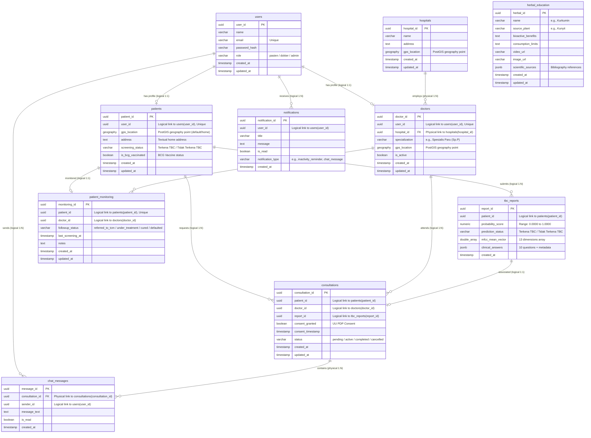

# DATABASE DESIGN SPECIFICATION - TBCheck (V1.0)

This document outlines the database design for the **TBCheck** mobile health (mHealth) ecosystem, as derived from the Product Requirements Document ([PRD.md](file:///D:/Projek/Android/Requirements/PRD.md)).

The database system is split into two primary architectures:
1. **Server-Side Database:** PostgreSQL (15+) with the **PostGIS** extension for location-based spatial queries and **pgcrypto** for secure UUID generation.
2. **Client-Side Database:** Encrypted local storage (Encrypted Hive / SQLite with SQLCipher) on the mobile device for offline inference caching and local reports.

---

### 1. Entity-Relationship Diagram (ERD)

The system's database operates under a **Modular Monolith** architecture. To allow future extraction of modules into separate microservice databases, **cross-module relationships** are defined as **logical references** (decoupled at the database layer and resolved at the application level via ID fetching, e.g., `GetID()`), while **intra-module relationships** retain physical `FOREIGN KEY` constraints.

In the diagram below, **dashed lines (`..`)** denote logical references across module boundaries, and **solid lines (`--`)** denote physical constraints inside a single module boundary.



---

## 2. Server-Side Data Dictionary (PostgreSQL)

### 2.1 Table: `users`
Stores credentials, core identity details, and system roles.
* **Module:** `auth-modul`

| Column | Data Type | Nullable | Constraints / Defaults | Description |
| --- | --- | --- | --- | --- |
| `user_id` | `UUID` | No | `PRIMARY KEY`, `DEFAULT gen_random_uuid()` | Unique identifier for each user. |
| `name` | `VARCHAR(255)` | No | - | User's full name. |
| `email` | `VARCHAR(255)` | No | `UNIQUE` | User's email address (login identifier). |
| `password_hash` | `VARCHAR(255)` | No | - | Bcrypt or Argon2 password hash. |
| `role` | `ENUM ('pasien', 'dokter', 'admin')` | No | - | User classification. |
| `created_at` | `TIMESTAMP WITH TZ` | No | `DEFAULT CURRENT_TIMESTAMP` | Date and time of user creation. |
| `updated_at` | `TIMESTAMP WITH TZ` | No | `DEFAULT CURRENT_TIMESTAMP` | Last update timestamp. |

---

### 2.2 Table: `patients`
Profiles specifically for patients. Extends `users` to store default addresses, geolocation data, and current screening statuses.
* **Module:** `screening-modul`
* **Important:** In accordance with medical screening principles, patients are **NOT** labeled under SVIR states (Susceptible, Vaccinated, Infected, Recovered) as individual clinical data. TBCheck is a screening tool, not a medical diagnostic device.

| Column | Data Type | Nullable | Constraints / Defaults | Description |
| --- | --- | --- | --- | --- |
| `patient_id` | `UUID` | No | `PRIMARY KEY`, `DEFAULT gen_random_uuid()` | Unique patient profile identifier. |
| `user_id` | `UUID` | No | `UNIQUE` | **Logical reference** to `users(user_id)` (Application-level). |
| `gps_location` | `GEOGRAPHY(Point, 4326)` | Yes | - | Default home location coordinates (for proximity matching). |
| `address` | `TEXT` | Yes | - | Textual home address. |
| `screening_status` | `ENUM ('Terkena TBC', 'Tidak Terkena TBC')` | No | `DEFAULT 'Tidak Terkena TBC'` | Screened binary status based on AI and clinical checklist. |
| `is_bcg_vaccinated` | `BOOLEAN` | No | `DEFAULT FALSE` | Clinical flag for BCG vaccination status. |
| `created_at` | `TIMESTAMP WITH TZ` | No | `DEFAULT CURRENT_TIMESTAMP` | Creation date. |
| `updated_at` | `TIMESTAMP WITH TZ` | No | `DEFAULT CURRENT_TIMESTAMP` | Last update timestamp. |

---

### 2.3 Table: `hospitals`
Stores hospitals partnered with TBCheck for telemedicine and clinical validation.
* **Module:** `doctor-modul`

| Column | Data Type | Nullable | Constraints / Defaults | Description |
| --- | --- | --- | --- | --- |
| `hospital_id` | `UUID` | No | `PRIMARY KEY`, `DEFAULT gen_random_uuid()` | Unique identifier for each hospital. |
| `name` | `VARCHAR(255)` | No | - | Name of the hospital or healthcare facility. |
| `address` | `TEXT` | No | - | Physical address of the hospital. |
| `gps_location` | `GEOGRAPHY(Point, 4326)` | No | - | Geolocation coordinates of the hospital. |
| `created_at` | `TIMESTAMP WITH TZ` | No | `DEFAULT CURRENT_TIMESTAMP` | Creation date. |
| `updated_at` | `TIMESTAMP WITH TZ` | No | `DEFAULT CURRENT_TIMESTAMP` | Last update timestamp. |

---

### 2.4 Table: `doctors`
Profiles specifically for doctors, linking them to users and hospitals.
* **Module:** `doctor-modul`

| Column | Data Type | Nullable | Constraints / Defaults | Description |
| --- | --- | --- | --- | --- |
| `doctor_id` | `UUID` | No | `PRIMARY KEY`, `DEFAULT gen_random_uuid()` | Unique doctor identifier. |
| `user_id` | `UUID` | No | `UNIQUE` | **Logical reference** to `users(user_id)` (Application-level). |
| `hospital_id` | `UUID` | No | `FOREIGN KEY` -> `hospitals(hospital_id)`, `ON DELETE RESTRICT` | **Physical reference** (Intra-module). Associated partner hospital. |
| `specialization` | `VARCHAR(255)` | No | `DEFAULT 'Spesialis Paru (Sp.P)'` | Medical specialty. |
| `gps_location` | `GEOGRAPHY(Point, 4326)` | No | - | Practice-specific coordinates for proximity search. |
| `is_active` | `BOOLEAN` | No | `DEFAULT TRUE` | Controls visibility in proximity queries. |
| `created_at` | `TIMESTAMP WITH TZ` | No | `DEFAULT CURRENT_TIMESTAMP` | Creation date. |
| `updated_at` | `TIMESTAMP WITH TZ` | No | `DEFAULT CURRENT_TIMESTAMP` | Last update timestamp. |

---

### 2.5 Table: `tbc_reports`
Stores results from the multimodal AI screening and clinical questionnaires.
* **Module:** `screening-modul`
* **Retention Policy:** Minimum 5 years (Standard legal medical record requirement).

| Column | Data Type | Nullable | Constraints / Defaults | Description |
| --- | --- | --- | --- | --- |
| `report_id` | `UUID` | No | `PRIMARY KEY`, `DEFAULT gen_random_uuid()` | Unique report identifier. |
| `patient_id` | `UUID` | No | - | **Logical reference** to `patients(patient_id)` (Application-level). |
| `probability_score` | `NUMERIC(5, 4)` | No | `CHECK (probability_score BETWEEN 0.0000 AND 1.0000)` | Output probability from TFLite LSTM. |
| `prediction_status` | `ENUM ('Terkena TBC', 'Tidak Terkena TBC')` | No | - | AI classification result. |
| `mfcc_mean_vector` | `DOUBLE PRECISION[]` | No | `CHECK (cardinality(mfcc_mean_vector) = 13)` | 13-dimensional average MFCC vector. |
| `clinical_answers` | `JSONB` | No | - | Holds raw patient answers to the 10 questions. |
| `created_at` | `TIMESTAMP WITH TZ` | No | `DEFAULT CURRENT_TIMESTAMP` | Simple timestamp of screening execution. |

---

### 2.6 Table: `consultations`
Tracks telemedicine consultations and ensures medical data sharing consent under UU PDP rules.
* **Module:** `consultation-modul`

| Column | Data Type | Nullable | Constraints / Defaults | Description |
| --- | --- | --- | --- | --- |
| `consultation_id` | `UUID` | No | `PRIMARY KEY`, `DEFAULT gen_random_uuid()` | Unique consultation session identifier. |
| `patient_id` | `UUID` | No | - | **Logical reference** to `patients(patient_id)` (Application-level). |
| `doctor_id` | `UUID` | No | - | **Logical reference** to `doctors(doctor_id)` (Application-level). |
| `report_id` | `UUID` | Yes | - | **Logical reference** to `tbc_reports(report_id)` (Application-level). |
| `consent_granted` | `BOOLEAN` | No | `DEFAULT FALSE` | User consent flag (UU PDP requirement). |
| `consent_timestamp` | `TIMESTAMP WITH TZ` | Yes | - | Timestamp when consent was checked by the user. |
| `status` | `ENUM ('pending', 'active', 'completed', 'cancelled')` | No | `DEFAULT 'pending'` | Status of the telemedicine session. |
| `created_at` | `TIMESTAMP WITH TZ` | No | `DEFAULT CURRENT_TIMESTAMP` | Creation timestamp. |
| `updated_at` | `TIMESTAMP WITH TZ` | No | `DEFAULT CURRENT_TIMESTAMP` | Modification timestamp. |

---

### 2.7 Table: `chat_messages`
Stores message transcripts for real-time consultation chats.
* **Module:** `consultation-modul`
* **Retention Policy:** 2 years after consultation completion.

| Column | Data Type | Nullable | Constraints / Defaults | Description |
| --- | --- | --- | --- | --- |
| `message_id` | `UUID` | No | `PRIMARY KEY`, `DEFAULT gen_random_uuid()` | Unique message identifier. |
| `consultation_id` | `UUID` | No | `FOREIGN KEY` -> `consultations(consultation_id)`, `ON DELETE CASCADE` | **Physical reference** (Intra-module). Active consultation session room. |
| `sender_id` | `UUID` | No | - | **Logical reference** to `users(user_id)` (Application-level). ID of sender (patient or doctor). |
| `message_text` | `TEXT` | No | - | Chat message text content. |
| `is_read` | `BOOLEAN` | No | `DEFAULT FALSE` | Delivery status. |
| `created_at` | `TIMESTAMP WITH TZ` | No | `DEFAULT CURRENT_TIMESTAMP` | Send timestamp. |

---

### 2.8 Table: `herbal_education`
Database containing curative phytotherapy research regarding safe herbal support for immune health.
* **Module:** `education-modul`

| Column | Data Type | Nullable | Constraints / Defaults | Description |
| --- | --- | --- | --- | --- |
| `herbal_id` | `UUID` | No | `PRIMARY KEY`, `DEFAULT gen_random_uuid()` | Unique herbal ID. |
| `name` | `VARCHAR(100)` | No | - | Phytochemical/compound name (e.g. Kurkumin, Gingerol). |
| `source_plant` | `VARCHAR(150)` | No | - | Scientific name/plant source (e.g. Kunyit). |
| `bioactive_benefits` | `TEXT` | No | - | Summarized benefits for pulmonary health/immunity. |
| `consumption_limits` | `TEXT` | No | - | Maximum dosages, side effects, and counter-indications. |
| `video_url` | `VARCHAR(255)` | Yes | - | Direct link to streaming education video. |
| `image_url` | `VARCHAR(255)` | Yes | - | Cover image link. |
| `scientific_sources` | `JSONB` | No | - | Array of medical journals/academic paper sources. |
| `created_at` | `TIMESTAMP WITH TZ` | No | `DEFAULT CURRENT_TIMESTAMP` | Creation timestamp. |
| `updated_at` | `TIMESTAMP WITH TZ` | No | `DEFAULT CURRENT_TIMESTAMP` | Modification timestamp. |

---

### 2.9 Table: `patient_monitoring`
Tracks the treatment compliance, follow-up status, and last screening activity of high-risk patients.
* **Module:** `monitoring-modul`

| Column | Data Type | Nullable | Constraints / Defaults | Description |
| --- | --- | --- | --- | --- |
| `monitoring_id` | `UUID` | No | `PRIMARY KEY`, `DEFAULT gen_random_uuid()` | Unique monitoring log identifier. |
| `patient_id` | `UUID` | No | `UNIQUE` | **Logical reference** to `patients(patient_id)` (Application-level). |
| `doctor_id` | `UUID` | No | - | **Logical reference** to `doctors(doctor_id)` (Application-level). |
| `followup_status` | `ENUM ('referred_to_tcm', 'under_treatment', 'cured', 'defaulted')` | No | `DEFAULT 'referred_to_tcm'` | Monitoring state of the patient. |
| `last_screening_at` | `TIMESTAMP WITH TZ` | Yes | - | Timestamp of the last synced screening report. Used to calculate inactivity. |
| `notes` | `TEXT` | Yes | - | Clinical monitoring progress notes. |
| `created_at` | `TIMESTAMP WITH TZ` | No | `DEFAULT CURRENT_TIMESTAMP` | Session start timestamp. |
| `updated_at` | `TIMESTAMP WITH TZ` | No | `DEFAULT CURRENT_TIMESTAMP` | Last updated timestamp. |

---

### 2.10 Table: `notifications`
Stores push and in-app notifications generated by the system (e.g., inactivity warnings, chat messages, or system reminders).
* **Module:** `notification-modul`

| Column | Data Type | Nullable | Constraints / Defaults | Description |
| --- | --- | --- | --- | --- |
| `notification_id` | `UUID` | No | `PRIMARY KEY`, `DEFAULT gen_random_uuid()` | Unique notification identifier. |
| `user_id` | `UUID` | No | - | **Logical reference** to `users(user_id)` (Application-level). Recipient of the alert. |
| `title` | `VARCHAR(255)` | No | - | Header of the notification. |
| `message` | `TEXT` | No | - | Detailed body of the notification. |
| `is_read` | `BOOLEAN` | No | `DEFAULT FALSE` | Status flag. |
| `notification_type` | `VARCHAR(50)` | No | - | Category (e.g., `'inactivity_reminder'`, `'chat'`, `'system'`). |
| `created_at` | `TIMESTAMP WITH TZ` | No | `DEFAULT CURRENT_TIMESTAMP` | Time generated. |

---

## 3. AI Architecture Specification

TBCheck uses a multimodal fusion deep learning architecture to combine acoustic parameters and clinical surveys for screening.

### 3.1 Structure
* **Audio Branch:** Processes time-series audio data. It takes 13 MFCC coefficients extracted from a standardized 5-second WAV recording (16 kHz, Mono) resulting in a shape of `[500, 13]`. This feeds into an LSTM layer (64 units) which yields a 32-dimensional Audio Embedding.
* **Questionnaire Branch:** Processes the 11-dimensional clinical checklist (10 binary responses + 1 min-max normalized age). It uses a Dense layer (16 units) to output a 16-dimensional Questionnaire Embedding.
* **Fusion Layer:** Concatenates the Audio and Questionnaire Embeddings into a single 48-dimensional joint vector.
* **Classifier:** Evaluates the fused vector through a Dense layer (16 units) and maps it to a single Sigmoid output node to compute the probability score (0 to 1).

### 3.2 Architectural Diagram

```text
  [ Audio Input (5s WAV, 16kHz, Mono) ]       [ Questionnaire Input (11 Features) ]
                 │                                              │
                 ▼                                              ▼
    [ MFCC Feature Vector (500, 13) ]                  [ Dense Layer (16) ]
                 │                                              │
                 ▼                                              ▼
        [ LSTM Layer (64) ]                      [ Questionnaire Embedding (16) ]
                 │                                              │
                 ▼                                              │
       [ Audio Embedding (32) ]                                 │
                 │                                              │
                 └──────────────────────► ◄─────────────────────┘
                                         │
                                         ▼ (Concatenate)
                                 [ Fusion Layer (48) ]
                                         │
                                         ▼
                                [ Dense Layer (16) ]
                                         │
                                         ▼ (Sigmoid)
                            [ Probability Score (0 - 1) ]
```

---

## 4. SVIR Epidemiological Risk Simulator Specification

### 4.1 Population Simulation vs. Individual Classification
In accordance with ethical AI guidelines and medical regulations, **SVIR is strictly utilized at the population/community level and NOT for individual labeling**:
* **Scientific Rationale:** The SVIR model is a differential equation compartmental model (*Susceptible, Vaccinated, Infected, Recovered*) designed mathematically to model population transmission dynamics. Applying these labels to individuals based on an unconfirmed mobile screening app is scientifically invalid and legally dangerous. A patient who screens positive is not clinically "Infected" (I) until validated by a Tes Cepat Molekuler (TCM) lab.
* **Decoupled Architecture:** Individual patient profiles only store their `screening_status` ('Terkena TBC' or 'Tidak Terkena TBC'). The SVIR simulator is a detached educational and projection module that uses aggregated regional risk counts to project hypothetical transmission speeds and generate visual risk density hotspots.

### 4.2 System Flow
The user journey flow is structured as follows:
```text
Screening AI ──► Risk Result ──► SVIR Simulator ──► Risk Trend ──► Population Projection ──► Community Risk Dashboard
```
1. **Screening AI:** User records cough and completes survey.
2. **Risk Result:** System displays binary screening status ('Terkena TBC' or 'Tidak Terkena TBC') with a medical disclaimer.
3. **SVIR Simulator:** User can input simulation variables (e.g. hypothetical local vaccination rates) in an education tab.
4. **Risk Trend:** Plots historical aggregated community screenings.
5. **Population Projection:** Estimates local spread rate based on regional population ratios.
6. **Community Risk Dashboard:** Visualizes regional hotspots for health authorities and public awareness.

---

## 5. Doctor Dashboard Specification

The doctor's dashboard telemonitoring console displays clinical data while excluding any S/V/I/R compartment labels for individual patients:
* **AI Probability Trend:** Line chart plotting the `probability_score` history of the patient.
* **Questionnaire Trend:** Interactive checklist tracking changes in symptoms across screening dates.
* **Consultation History:** Chronological records of chat messages and shared screening reports.
* **Follow-up Status:** Tracks the clinical progress of referred high-risk patients (e.g. referred to TCM, completed treatments).

---

## 6. Query Performance Optimization

### 6.1 Indexing Strategy
* **Spatial Indexing (GiST):** Created on `patients.gps_location`, `hospitals.gps_location`, and `doctors.gps_location` to speed up regional lookups.
* **B-Tree Indexes:** Created on logical foreign key columns (`patients.user_id`, `doctors.user_id`, `tbc_reports.patient_id`, `consultations.patient_id`, `consultations.doctor_id`, `consultations.report_id`, `chat_messages.sender_id`, `patient_monitoring.patient_id`, `patient_monitoring.doctor_id`, `notifications.user_id`) and `patients.screening_status` to optimize database searches and logical joins at the application layer.

### 6.2 Decoupled Proximity Spatial Query (Doctor Module)
Finds the closest hospital/doctor clinics relative to the patient's coordinates. To respect modular boundaries, this query runs inside the **Doctor Module** and does not join `patients` or `users`. The patient's GPS coordinates (`:patient_gps`) are retrieved beforehand from the Patient profile in the Screening module. The doctor's name is fetched at the application layer by query mapping over the Auth module using the returned `user_id`s.

```sql
SELECT 
    d.doctor_id,
    d.user_id, -- Used to map names from the Auth Module at the application level
    h.name AS hospital_name,
    ST_Distance(d.gps_location, :patient_gps) / 1000.0 AS distance_km
FROM doctors d
JOIN hospitals h ON d.hospital_id = h.hospital_id
WHERE d.is_active = TRUE
  AND ST_DWithin(d.gps_location, :patient_gps, 50000) -- 50 km radius limit
ORDER BY distance_km ASC;
```

### 6.3 Community Risk Aggregation Query (Screening Module)
Aggregates regional risk categories for the Community Risk Dashboard. Runs entirely within the **Screening Module** on the `patients` table:

```sql
SELECT 
    p.screening_status,
    COUNT(*) AS patient_count,
    COUNT(*) * 100.0 / SUM(COUNT(*)) OVER() AS percentage
FROM patients p
WHERE p.gps_location IS NOT NULL
  AND ST_DWithin(p.gps_location, ST_SetSRID(ST_MakePoint(:user_longitude, :user_latitude), 4326)::geography, 10000) -- 10 km radius limit
GROUP BY p.screening_status;
```

### 6.4 Monitoring Compliance Query (Monitoring Module)
Finds patients who are active under treatment/follow-up but have not submitted or synced any screening reports for 3 days or more. Runs inside the **Monitoring Module**:

```sql
SELECT 
    pm.monitoring_id,
    pm.patient_id, -- Used to notify patient via Notification module
    pm.doctor_id, -- Used to highlight alerts on doctor's dashboard
    pm.last_screening_at
FROM patient_monitoring pm
WHERE pm.last_screening_at < NOW() - INTERVAL '3 days'
  AND pm.followup_status IN ('under_treatment', 'referred_to_tcm');
```

---

## 7. Client-Side Database Schema (Offline Caching & Sync)

To support 100% offline screening capabilities, the mobile application maintains a local database (encrypted using Hive or SQLite via SQLCipher). This database caches screening reports and manages synchronization status.

### 7.1 Table / Box: `local_reports`
Caches the results of offline AI screenings before they are successfully synchronized to the PostgreSQL cloud server.

| Attribute / Field | Data Type | Nullable | Description |
| --- | --- | --- | --- |
| `local_report_id` | `VARCHAR (UUID)` | No | Local primary key. |
| `patient_id` | `VARCHAR (UUID)` | No | Patient identifier matching the profile. |
| `probability_score` | `DOUBLE` | No | Score (0.0 to 1.0) returned by the TFLite LSTM model. |
| `prediction_status` | `VARCHAR` | No | Screening classification: `'Terkena TBC'` or `'Tidak Terkena TBC'`. |
| `mfcc_mean_vector` | `LIST<DOUBLE>` | No | 13-dimensional average MFCC list. |
| `clinical_answers` | `MAP / JSON String` | No | Map of the 10 binary questionnaire answers + metadata. |
| `created_at` | `TIMESTAMP / ISO8601` | No | Timestamp of the screening. |
| `sync_status` | `VARCHAR` | No | Sync state: `'pending'` (yet to sync) or `'synced'` (successfully uploaded). |
| `last_sync_attempt` | `TIMESTAMP / ISO8601` | Yes | Last timestamp when the background worker tried to upload the data. |
```
