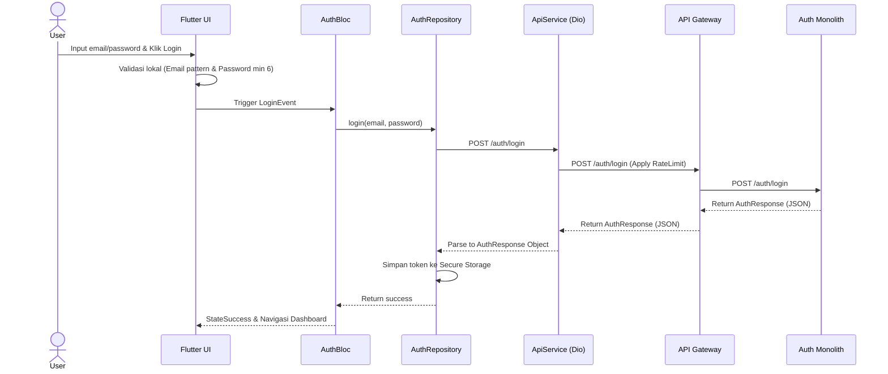

# 📱 Panduan Resmi Integrasi API TBCheck — Flutter Developer Edition

> **Versi**: 1.0 | **Tanggal**: 24 Juli 2026  
> **Base URL Gateway**: `https://<gateway-host>:8000` (atau gunakan host environment local untuk testing/production)  
> **Format**: JSON / Multipart-Form-Data (untuk file upload)

---

## 1. Panduan Best Practice Client-Side (Flutter)

Sebelum memulai integrasi per modul, pastikan tim Flutter menerapkan best practice berikut untuk menjamin keamanan, efisiensi network, dan modularitas kode:

### A. HTTP Client: Dio
Gunakan package `dio` sebagai HTTP client utama karena kemudahan kustomisasi interceptor, timeout handling, dan multipart uploading.

```yaml
dependencies:
  dio: ^5.4.0
  flutter_secure_storage: ^9.0.0 # Penyimpanan Kunci/Token Medis & Sesi
  shared_preferences: ^2.2.0    # Penyimpanan Non-Sensitif / Cache UI
```

### B. Interceptors & Automatic Token Refresh
Gunakan interceptor untuk:
1. Menyuntikkan `Authorization: Bearer <access_token>` secara otomatis ke endpoint terproteksi.
2. Menyuntikkan header `X-Request-ID` untuk mempermudah debugging log.
3. Menangani request baru otomatis jika token expired (`401 Unauthorized`).

```dart
class AuthInterceptor extends Interceptor {
  final Dio dio;
  final FlutterSecureStorage storage;

  AuthInterceptor(this.dio, this.storage);

  @override
  void onRequest(RequestOptions options, RequestInterceptorHandler handler) async {
    final token = await storage.read(key: 'access_token');
    if (token != null) {
      options.headers['Authorization'] = 'Bearer $token';
    }
    options.headers['X-Request-ID'] = DateTime.now().millisecondsSinceEpoch.toString();
    return handler.next(options);
  }

  @override
  void onError(DioException err, ErrorInterceptorHandler handler) async {
    if (err.response?.statusCode == 401) {
      // Mencegah looping infinite jika request refresh token sendiri yang 401
      if (err.requestOptions.path == '/auth/refresh') {
        return handler.next(err);
      }
      
      final success = await _attemptTokenRefresh();
      if (success) {
        // Retry original request dengan token baru
        final token = await storage.read(key: 'access_token');
        err.requestOptions.headers['Authorization'] = 'Bearer $token';
        
        final response = await dio.fetch(err.requestOptions);
        return handler.resolve(response);
      } else {
        // Redirect ke login screen jika refresh gagal
        _triggerLogoutRedirect();
      }
    }
    return handler.next(err);
  }

  Future<bool> _attemptTokenRefresh() async {
    final refreshToken = await storage.read(key: 'refresh_token');
    if (refreshToken == null) return false;

    try {
      final response = await dio.post('/auth/refresh', data: {
        'refresh_token': refreshToken,
      });
      if (response.statusCode == 200) {
        final newAccessToken = response.data['access_token'];
        final newRefreshToken = response.data['refresh_token'];
        await storage.write(key: 'access_token', value: newAccessToken);
        await storage.write(key: 'refresh_token', value: newRefreshToken);
        return true;
      }
    } catch (e) {
      return false;
    }
    return false;
  }
  
  void _triggerLogoutRedirect() {
    // Implementasikan event navigasi global ke Login Screen (misal: RxBus, BLoC, Riverpod)
  }
}
```

### C. Clean Architecture & Layering
Pisahkan struktur kode ke dalam tiga layer utama:
1. **Data Layer**: DTO (Data Transfer Object) models, Local Storage, API Service (Dio).
2. **Domain Layer**: Entity models, Repositories interface, Usecases.
3. **Presentation Layer**: UI (Widgets), State Management (Cubit/BLoC/Riverpod).

---

## 2. Integrasi Per Module

---

### 2.1 Authentication Module

#### Tujuan Module
Mengelola siklus pendaftaran akun, autentikasi login (termasuk Google Sign-in untuk perangkat mobile), pengelolaan sesi, lupa password, verifikasi email OTP, dan global logout.

#### User Flow
```
User membuka halaman login
   ↓
Pilih Login Biasa (Email & Password) ATAU Google Login
   ↓ (Jika Google Login)
Trigger Google Native SDK (Flutter) → Dapatkan id_token
   ↓
Kirim POST /auth/google/mobile-login
   ↓ (Jika Login Biasa)
Call POST /auth/login
   ↓
Simpan Access Token (Secure Storage), User ID, dan Role
   ↓
Navigasi ke Dashboard (PATIENT atau DOCTOR)
```

#### Endpoint yang Digunakan
| Fitur Mobile | Endpoint | Method | Authentication | Rate Limit | Keterangan |
|---|---|---|---|---|---|
| Register Akun | `/auth/register` | POST | ❌ | Ketat (3/min) | |
| Login Email | `/auth/login` | POST | ❌ | Normal (5/min) | |
| Login Google | `/auth/google/mobile-login` | POST | ❌ | Normal (5/min) | Verifikasi ID Token dari SDK Flutter |
| Refresh Token | `/auth/refresh` | POST | ❌ | Longgar (10/min) | Dipanggil via Interceptor |
| Verifikasi OTP | `/auth/verify-email` | POST | ❌ | Normal (5/min) | |
| Resend OTP | `/auth/resend-verification` | POST | ❌ | Ketat (3/min) | |
| Lupa Password | `/auth/forgot-password` | POST | ❌ | Ketat (3/min) | |
| Reset Password | `/auth/reset-password` | POST | ❌ | Ketat (3/min) | Menggunakan OTP dari email |
| Logout Sesi | `/auth/logout` | POST | ❌ | Longgar (10/min) | Header `X-Refresh-Token` disarankan |

#### Alur Request
- **Kapan dikirim**: Sesuai interaksi tombol form di UI.
- **Data yang dikirim**: Body JSON sesuai model `RegisterRequest` / `LoginRequest`.
- **Validasi sebelum request**:
  - Email harus valid regexp: `^[a-zA-Z0-9+_.-]+@[a-zA-Z0-9.-]+$`
  - Password minimal 6 karakter.
- **Loading State**: Tombol login dinonaktifkan, tampilkan `CircularProgressIndicator`.
- **Retry jika gagal**: Jangan lakukan auto-retry untuk `401` login biasa. Hanya lakukan auto-retry jika koneksi timeout (maksimal 3 kali).

#### Alur Response
- **Success (200/201)**:
  - Ekstrak token dan data user.
  - Simpan access token (15m) & refresh token (7d) ke `FlutterSecureStorage`.
  - Update state user di state management.
  - Navigasi ke `/api/v1/patient/dashboard` jika role `PATIENT` atau `/api/v1/doctor/dashboard` jika `DOCTOR`.
- **Error (4xx/5xx)**:
  - **`400`**: Tampilkan error validasi field ke user.
  - **`401`**: Kredensial salah / OTP salah. Tampilkan pesan kesalahan di input.
  - **`403`**: Email belum terverifikasi. Navigasi otomatis ke halaman Verifikasi OTP.
  - **`429`**: Terlalu banyak request. Tampilkan hitung mundur reset limit. Jika melanggar 3x dalam 10 menit, **IP akan di-ban selama 30 menit (mengembalikan 403)**. Tampilkan dialog informatif ban.
  - **`500`**: Tampilkan global error dialog "Terjadi kesalahan server".

#### State Management
Rekomendasi State: `AuthState`
- `AuthInitial`: Kondisi sebelum input.
- `AuthLoading`: Saat proses request berlangsung.
- `AuthSuccess`: Autentikasi berhasil, memuat data user.
- `AuthUnverified`: Login berhasil tapi email belum diverifikasi (mengarahkan ke OTP view).
- `AuthFailure`: Terjadi error (koneksi, salah password, atau diblokir).

#### Model Data (Flutter)
```dart
class UserDTO {
  final String userId;
  final String name;
  final String email;
  final String role;

  UserDTO({required this.userId, required this.name, required this.email, required this.role});

  factory UserDTO.fromJson(Map<String, dynamic> json) {
    return UserDTO(
      userId: json['user_id'] as String,
      name: json['name'] as String,
      email: json['email'] as String,
      role: json['role'] as String,
    );
  }
}

class AuthResponse {
  final String accessToken;
  final String refreshToken;
  final int expiresIn;
  final int refreshExpiresIn;
  final UserDTO user;

  AuthResponse({
    required this.accessToken,
    required this.refreshToken,
    required this.expiresIn,
    required this.refreshExpiresIn,
    required this.user,
  });

  factory AuthResponse.fromJson(Map<String, dynamic> json) {
    return AuthResponse(
      accessToken: json['access_token'] as String,
      refreshToken: json['refresh_token'] as String,
      expiresIn: json['expires_in'] as int,
      refreshExpiresIn: json['refresh_expires_in'] as int,
      user: UserDTO.fromJson(json['user'] as Map<String, dynamic>),
    );
  }
}
```

#### Repository Layer
`AuthRepository`
- `Future<AuthResponse> login(String email, String password, {String? deviceId, String? deviceName});`
- `Future<AuthResponse> loginWithGoogle(String idToken, {String? deviceId, String? deviceName});`
- `Future<void> register(String name, String email, String password, String role);`
- `Future<void> verifyEmail(String email, String otp);`
- `Future<void> resendOTP(String email);`
- `Future<void> forgotPassword(String email);`
- `Future<void> resetPassword(String email, String otp, String newPassword);`
- `Future<void> logout({bool allDevices = false});`

#### Local Storage
- **`access_token`** (secure): Tulis saat login/refresh sukses.
- **`refresh_token`** (secure): Tulis saat login/refresh sukses, hapus saat logout.
- **`user_id` & `user_role`** (pref): Digunakan untuk routing dashboard.

#### Diagram Sequence


#### Checklist Implementasi Module
- [ ] Integrasi Google Sign-in Native SDK di Android & iOS
- [ ] Model `AuthResponse` & `UserDTO` selesai dibuat
- [ ] `AuthRepository` & `AuthService` selesai dibuat
- [ ] Logic auto-login jika `access_token` masih valid
- [ ] Interceptor Auto-Refresh Token selesai
- [ ] Penanganan Error 429 & IP Ban 403
- [ ] UI Login & Register Screen terhubung

---

### 2.2 Identity Module (Profile)

#### Tujuan Module
Mengelola informasi personal sensitif pengguna (NIK, KK, nama, telepon, dan alamat yang dilindungi sesuai UU PDP) serta memperbarui koordinat spasial lokasi GPS untuk pemetaan regional.

#### User Flow
```
User membuka tab Profile
   ↓
Aplikasi memanggil GET /api/v1/profile
   ↓
Pemuatan data (menampilkan avatar, nama, NIK ter-masking)
   ↓
User ingin ubah profile
   ↓
Ganti isian & upload foto profil baru
   ↓
Call PUT /api/v1/profile/patient (atau /doctor)
   ↓
Tampilkan pesan sukses & refresh data profil
```

#### Endpoint yang Digunakan
| Fitur Mobile | Endpoint | Method | Authentication | Keterangan |
|---|---|---|---|---|
| Ambil Profil Sendiri | `/api/v1/profile` | GET | ✅ Bearer | Otomatis deteksi role dari Token |
| Edit Profil Pasien | `/api/v1/profile/patient` | PUT | ✅ Bearer | Menggunakan multipart untuk avatar |
| Edit Profil Dokter | `/api/v1/profile/doctor` | PUT | ✅ Bearer | Menggunakan multipart untuk avatar |
| Perbarui Lokasi GPS | `/api/v1/profile/location` | PUT | ✅ Bearer | Mengirim data spasial koordinat |
| Upload Avatar Saja | `/api/v1/profile/avatar` | POST | ✅ Bearer | Multipart file |

#### Alur Request
- **Kapan dikirim**:
  - `GET /api/v1/profile` dikirim saat inisialisasi tab profil atau saat butuh verifikasi role.
  - `PUT /api/v1/profile/location` dikirim secara periodik (misal 15 menit sekali di background jika diizinkan pasien) atau saat melakukan skrining batuk.
- **Validasi sebelum request**:
  - Telepon minimal 10 digit, hanya angka.
  - NIK harus 16 digit.
  - Nomor KK harus 16 digit.
  - Format tanggal lahir harus YYYY-MM-DD.

#### Alur Response
- **Success (200)**:
  - Parse JSON ke model `PatientProfile` atau `DoctorProfile`.
  - Tampilkan data di UI.
  - Simpan nama dan foto profil di shared preferences untuk optimasi load UI.
- **Error**:
  - **`400`**: Validasi gagal (format NIK/KK salah). Tampilkan inline error di input form.
  - **`403`**: Akses ditolak jika pasien mencoba memanggil endpoint update dokter (atau sebaliknya).

#### Model Data (Flutter)
```dart
class PatientProfile {
  final String patientId;
  final String userId;
  final String fullName;
  final String phone;
  final String gender;
  final String birthDate;
  final String address;
  final double? latitude;
  final double? longitude;
  final bool bcgVaccinated;
  final String profilePictureUrl;
  final String nik;
  final String kkNumber;

  PatientProfile({
    required this.patientId,
    required this.userId,
    required this.fullName,
    required this.phone,
    required this.gender,
    required this.birthDate,
    required this.address,
    this.latitude,
    this.longitude,
    required this.bcgVaccinated,
    required this.profilePictureUrl,
    required this.nik,
    required this.kkNumber,
  });

  factory PatientProfile.fromJson(Map<String, dynamic> json) {
    return PatientProfile(
      patientId: json['patient_id'] as String,
      userId: json['user_id'] as String,
      fullName: json['full_name'] as String,
      phone: json['phone'] as String,
      gender: json['gender'] as String,
      birthDate: json['birth_date'] as String,
      address: json['address'] as String,
      latitude: (json['latitude'] as num?)?.toDouble(),
      longitude: (json['longitude'] as num?)?.toDouble(),
      bcgVaccinated: json['bcg_vaccinated'] as bool? ?? false,
      profilePictureUrl: json['profile_picture_url'] as String? ?? "",
      nik: json['nik'] as String? ?? "",
      kkNumber: json['kk_number'] as String? ?? "",
    );
  }
}
```

#### Repository Layer
`IdentityRepository`
- `Future<dynamic> getMyProfile();` // Mengembalikan PatientProfile atau DoctorProfile
- `Future<void> updatePatientProfile(PatientProfileUpdateRequest req, {File? avatarFile});`
- `Future<void> updateLocation(double latitude, double longitude);`

#### Checklist Implementasi Module
- [ ] Model `PatientProfile` & `DoctorProfile`
- [ ] Penggunaan package `geolocator` untuk mengambil koordinat GPS
- [ ] Form edit profil pasien dengan upload foto dari gallery/camera
- [ ] Masking NIK/KK di UI (hanya tampilkan 4 digit terakhir)
- [ ] Unit Test `IdentityRepository`

---

### 2.3 Screening Module (Skrining Mandiri)

#### Tujuan Module
Mengirim rekaman suara batuk (format WAV/PCM) untuk dianalisis oleh AI serta mengisi kuesioner klinis untuk memprediksi probabilitas keterjangkitan penyakit TBC.

#### User Flow
```
User memilih menu "Skrining Batuk"
   ↓
Berikan persetujuan akses Mikrofon
   ↓
Rekam suara batuk selama 3-5 detik
   ↓
Isi kuesioner klinis (gejala demam, berat badan turun, dll)
   ↓
Aplikasi melakukan ekstraksi MFCC lokal (jika didukung) ATAU mengirim audio ke backend
   ↓
Call POST /api/v1/screening/reports
   ↓
Tampilkan hasil prediksi ("Terkena TBC" / "Tidak Terkena TBC") dan tingkat probabilitas
```

#### Endpoint yang Digunakan
| Fitur Mobile | Endpoint | Method | Authentication | Keterangan |
|---|---|---|---|---|
| Kirim Hasil Skrining | `/api/v1/screening/reports` | POST | ✅ Bearer | Mengirim data kuesioner + MFCC Vector |
| Ambil Riwayat Skrining | `/api/v1/screening/reports` | GET | ✅ Bearer | Mengembalikan list riwayat milik user |
| Detail Skrining Spesifik | `/api/v1/screening/reports/:id` | GET | ✅ Bearer | Hanya pemilik/dokter yang diizinkan |

#### Alur Request
- **Ketergantungan**: Pasien harus memperbarui lokasi GPS terlebih dahulu agar hasil analisis regional akurat.
- **Data yang dikirim**: Body JSON `CreateScreeningReportRequest`:
  - `probability_score`: Angka desimal (0-1) hasil analisis.
  - `prediction_status`: String `"Terkena TBC"` atau `"Tidak Terkena TBC"`.
  - `mfcc_mean_vector`: Array berukuran 13 berisi koefisien MFCC.
  - `clinical_answers`: Key-value map kuesioner.

#### Model Data (Flutter)
```dart
class ScreeningReport {
  final String reportId;
  final String patientId;
  final double probabilityScore;
  final String predictionStatus;
  final List<double> mfccMeanVector;
  final Map<String, dynamic> clinicalAnswers;
  final DateTime createdAt;

  ScreeningReport({
    required this.reportId,
    required this.patientId,
    required this.probabilityScore,
    required this.predictionStatus,
    required this.mfccMeanVector,
    required this.clinicalAnswers,
    required this.createdAt,
  });

  factory ScreeningReport.fromJson(Map<String, dynamic> json) {
    return ScreeningReport(
      reportId: json['report_id'] as String,
      patientId: json['patient_id'] as String,
      probabilityScore: (json['probability_score'] as num).toDouble(),
      predictionStatus: json['prediction_status'] as String,
      mfccMeanVector: (json['mfcc_mean_vector'] as List<dynamic>).map((e) => (e as num).toDouble()).toList(),
      clinicalAnswers: json['clinical_answers'] as Map<String, dynamic>,
      createdAt: DateTime.parse(json['created_at'] as String),
    );
  }
}
```

#### Repository Layer
`ScreeningRepository`
- `Future<ScreeningReport> submitReport(CreateScreeningReportRequest req);`
- `Future<List<ScreeningReport>> getMyReports({int limit = 100, int page = 1});`
- `Future<ScreeningReport> getReportById(String reportId);`

#### Checklist Implementasi Module
- [ ] Setup recorder audio format WAV/PCM (misal: `record` / `flutter_sound` package)
- [ ] Validasi durasi rekaman minimal 3 detik, maksimal 10 detik
- [ ] Integrasi pengiriman parameter MFCC vector (13 float)
- [ ] UI hasil skrining dengan visualisasi tingkat keparahan (grafik donat/gauge)

---

### 2.4 Consultation Module (Telemedicine)

#### Tujuan Module
Memungkinkan komunikasi real-time antara pasien dan dokter spesialis melalui media chat dengan enkripsi ujung-ke-ujung (End-to-End Encryption - E2EE) berbasis kunci publik-privat.

#### User Flow
```
User memilih dokter aktif dari daftar
   ↓
Klik tombol "Hubungi Dokter"
   ↓
Generate pasangan kunci RSA (Public/Private Key) di device (jika belum ada)
   ↓
Unggah Public Key via POST /api/v1/consultations/keys
   ↓
Call POST /api/v1/consultations untuk membuat sesi
   ↓
Tarik kunci publik dokter via GET /api/v1/consultations/keys/:doctor_user_id
   ↓
Hubungkan ke WebSocket GET /api/v1/consultations/:id/ws
   ↓
Kirim chat (Enkripsi pesan dengan Kunci Publik tujuan)
   ↓
Terima chat (Dekripsi pesan dengan Kunci Privat sendiri)
```

#### Endpoint yang Digunakan
| Fitur Mobile | Endpoint | Method | Authentication | Keterangan |
|---|---|---|---|---|
| Buat Sesi Konsultasi | `/api/v1/consultations` | POST | ✅ Bearer | Harus menyertakan persetujuan medis |
| Ambal Daftar Konsultasi | `/api/v1/consultations` | GET | ✅ Bearer | Filter sesuai role login |
| Ambil Sesi Tertentu | `/api/v1/consultations/:id` | GET | ✅ Bearer | |
| Tarik Riwayat Pesan | `/api/v1/consultations/:id/messages` | GET | ✅ Bearer | Berisi ciphertext E2EE |
| Simpan Kunci Publik E2EE | `/api/v1/consultations/keys` | POST | ✅ Bearer | Disimpan ke server |
| Tarik Kunci Publik Tujuan | `/api/v1/consultations/keys/:user_id` | GET | ✅ Bearer | Untuk enkripsi pesan sebelum dikirim |
| Koneksi Chat Real-time | `/api/v1/consultations/:id/ws` | GET | ✅ Bearer | Koneksi WebSocket |

#### Alur Request
- **E2EE Workflow**:
  1. Buat Keypair RSA 2048-bit secara lokal menggunakan package `pointycastle` atau `cryptography`.
  2. Simpan Kunci Privat lokal di `FlutterSecureStorage` (Jangan pernah kirim ke server!).
  3. Kirim Kunci Publik ke server melalui endpoint `/api/v1/consultations/keys`.
  4. Untuk mengirim pesan:
     - Ambil Kunci Publik tujuan (Dokter atau Pasien).
     - Enkripsi teks pesan -> Hasil string Base64.
     - Kirim payload terenkripsi via WebSocket.

#### Model Data (Flutter)
```dart
class Consultation {
  final String consultationId;
  final String patientId;
  final String doctorId;
  final String? reportId;
  final bool consentGranted;
  final DateTime? consentTimestamp;
  final String status;
  final DateTime createdAt;

  Consultation({
    required this.consultationId,
    required this.patientId,
    required this.doctorId,
    this.reportId,
    required this.consentGranted,
    this.consentTimestamp,
    required this.status,
    required this.createdAt,
  });

  factory Consultation.fromJson(Map<String, dynamic> json) {
    return Consultation(
      consultationId: json['consultation_id'] as String,
      patientId: json['patient_id'] as String,
      doctorId: json['doctor_id'] as String,
      reportId: json['report_id'] as String?,
      consentGranted: json['consent_granted'] as bool? ?? false,
      consentTimestamp: json['consent_timestamp'] != null ? DateTime.parse(json['consent_timestamp'] as String) : null,
      status: json['status'] as String,
      createdAt: DateTime.parse(json['created_at'] as String),
    );
  }
}
```

#### Checklist Implementasi Module
- [ ] Implementasi generate RSA keypair di local device
- [ ] Penyimpanan Private Key aman di `FlutterSecureStorage`
- [ ] Integrasi library WebSocket (package `web_socket_channel`)
- [ ] Logic enkripsi pesan sebelum dikirim & dekripsi pesan saat diterima
- [ ] UI Chat Bubble dengan status E2EE (indikator gembok terkunci)

---

### 2.5 Education Module

#### Tujuan Module
Menyediakan artikel edukasi dan video tutorial seputar penanganan tuberkulosis, pemantauan progress membaca pengguna, serta ensiklopedia tanaman herbal.

#### User Flow
```
User masuk ke menu "Edukasi"
   ↓
Aplikasi memanggil GET /api/v1/education
   ↓
Tampilkan daftar artikel / video
   ↓
Pilih salah satu konten
   ↓
Kirim progres membaca secara berkala (PUT /api/v1/education/:id/progress)
```

#### Endpoint yang Digunakan
| Fitur Mobile | Endpoint | Method | Authentication | Keterangan |
|---|---|---|---|---|
| List Artikel/Video | `/api/v1/education` | GET | ✅ Bearer | |
| Detail Artikel/Video | `/api/v1/education/:id` | GET | ✅ Bearer | |
| Pencarian & Filter Tag | `/api/v1/education/search` | GET | ✅ Bearer | |
| Progress Belajar User | `/api/v1/education/progress` | GET | ✅ Bearer | |
| Update Progress Baca | `/api/v1/education/:id/progress` | PUT | ✅ Bearer | Mengirim persentase (0-100) |
| List Ensiklopedia Herbal | `/api/v1/education/herbal` | GET | ✅ Bearer | |
| Detail Tanaman Herbal | `/api/v1/education/herbal/:id` | GET | ✅ Bearer | |

#### Checklist Implementasi Module
- [ ] Pemutar Video YouTube (package `youtube_player_flutter`)
- [ ] Render dokumen artikel Markdown/HTML
- [ ] Auto-save progress baca saat user melakukan scroll artikel (Debounce 2 detik sebelum hit API)
- [ ] UI Ensiklopedia Herbal dengan filter kelompok kimia tanaman

---

### 2.6 Notification Module

#### Tujuan Module
Mengelola registrasi token FCM perangkat dan menampilkan riwayat push notification (pemberitahuan jadwal obat, alarm monitoring, atau chat telemedicine masuk).

#### Endpoint yang Digunakan
| Fitur Mobile | Endpoint | Method | Authentication | Keterangan |
|---|---|---|---|---|
| Registrasi Token FCM | `/api/v1/notifications/device-token` | POST | ✅ Bearer | Wajib dipanggil saat login sukses |
| Ambil Notifikasi Saya | `/api/v1/notifications` | GET | ✅ Bearer | |
| Tandai Terbaca | `/api/v1/notifications/:id/read` | PUT | ✅ Bearer | |
| Tandai Semua Terbaca | `/api/v1/notifications/read-all` | PUT | ✅ Bearer | |

#### Alur Integrasi FCM (Firebase Cloud Messaging)
1. Inisialisasi Firebase SDK di Flutter.
2. Minta izin push notification dari OS (`FirebaseMessaging.instance.requestPermission()`).
3. Dapatkan token FCM (`FirebaseMessaging.instance.getToken()`).
4. Daftarkan token tersebut ke backend via `POST /api/v1/notifications/device-token` beserta unique device ID.

#### Checklist
- [ ] Inisialisasi Firebase Core & Messaging
- [ ] Service pendaftaran token FCM ke Gateway
- [ ] Badge counter notifikasi belum terbaca di UI
- [ ] Push Notification listener saat app berada di Foreground/Background

---

### 2.7 Monitoring Module (Khusus Dokter & Pasien Mandiri)

#### Tujuan Module
Memantau kemajuan kepatuhan minum obat pasien, tren hasil skrining, serta status kepatuhan pasien agar dokter dapat mendeteksi kondisi darurat atau pasien mangkir pengobatan (*defaulted*).

#### Endpoint yang Digunakan
| Fitur Mobile | Endpoint | Method | Authentication | Keterangan |
|---|---|---|---|---|
| List Pasien Saya (Dokter) | `/api/v1/monitoring/patients` | GET | ✅ Bearer | Hanya role DOCTOR / ADMIN |
| Detail Monitoring Pasien | `/api/v1/monitoring/patients/:patient_id` | GET | ✅ Bearer | |
| Update Status / Catatan | `/api/v1/monitoring/patients/:patient_id` | PUT | ✅ Bearer | Hanya role DOCTOR / ADMIN |
| Tren Klinis Skrining | `/api/v1/monitoring/patients/:patient_id/trends` | GET | ✅ Bearer | Mengembalikan grafik probabilitas & kuesioner |

#### Checklist
- [ ] UI Dashboard Dokter (List pasien dengan indikator status pengobatan)
- [ ] Grafik visualisasi tren kepatuhan & skor probabilitas (package `fl_chart`)
- [ ] Form input catatan klinis oleh Dokter

---

### 2.8 Doctor Module

#### Tujuan Module
Membantu pasien mencari dan menemukan daftar dokter pulmonologi terdekat berbasis lokasi GPS secara real-time.

#### Endpoint yang Digunakan
| Fitur Mobile | Endpoint | Method | Authentication | Keterangan |
|---|---|---|---|---|
| Cari Dokter Terdekat | `/api/v1/doctors/nearest` | GET | ✅ Bearer | Spatial query berbasis radius |
| Detail Dokter | `/api/v1/doctors/:id` | GET | ✅ Bearer | |
| Update Status Online | `/api/v1/doctors/availability` | PUT | ✅ Bearer | Khusus DOCTOR (ONLINE/OFFLINE) |

#### Checklist
- [ ] UI List Dokter terdekat dengan informasi jarak (meter)
- [ ] Integrasi lokasi realtime pasien ke parameter request
- [ ] Toggle ketersediaan menerima pasien bagi dokter

---

### 2.9 Hospital Module

#### Tujuan Module
Menampilkan daftar rumah sakit rujukan Tes Cepat Molekuler (TCM) tuberkulosis aktif yang terintegrasi di sistem.

#### Endpoint yang Digunakan
| Fitur Mobile | Endpoint | Method | Authentication | Keterangan |
|---|---|---|---|---|
| Daftar Semua RS | `/api/v1/hospitals` | GET | ✅ Bearer | |
| Detail Rumah Sakit | `/api/v1/hospitals/:id` | GET | ✅ Bearer | |

#### Checklist
- [ ] UI Daftar Rumah Sakit TCM
- [ ] Integrasi peta rute ke RS Rujukan (Map launcher ke Google Maps/Apple Maps)

---

### 2.10 Storage Module

#### Tujuan Module
Mengelola upload file lampiran (rekaman batuk mentah, foto dokumen medis, dan logo instansi) ke penyimpanan cloud terpusat.

#### Endpoint yang Digunakan
| Fitur Mobile | Endpoint | Method | Authentication | Keterangan |
|---|---|---|---|---|
| Upload File | `/api/v1/files` | POST | ✅ Bearer | Multipart file upload |
| Download File | `/api/v1/files/:id` | GET | ✅ Bearer | Mengembalikan binary stream |
| Hapus File | `/api/v1/files/:id` | DELETE | ✅ Bearer | |

#### Checklist
- [ ] Request helper Multipart upload via Dio (`FormData`)
- [ ] Penanganan loading progres bar (%) upload/download file
- [ ] Validasi ukuran file maks 5MB sebelum upload

---

### 2.11 Settings & Dashboard Module

#### Tujuan Module
Menyediakan ringkasan status operasional (dashboard) untuk masing-masing role dan konfigurasi pengaturan sistem.

#### Endpoint yang Digunakan
| Fitur Mobile | Endpoint | Method | Authentication | Keterangan |
|---|---|---|---|---|
| Dashboard Pasien | `/api/v1/patient/dashboard` | GET | ✅ Bearer | Role PATIENT / ADMIN |
| Dashboard Dokter | `/api/v1/doctor/dashboard` | GET | ✅ Bearer | Role DOCTOR / ADMIN |
| System Settings | `/api/v1/admin/system-settings` | GET | ✅ Bearer | Role ADMIN |

> [!IMPORTANT]
> **Backward Compatibility**: API Gateway secara otomatis melakukan redirect status `308 Permanent Redirect` jika aplikasi mobile lama masih memanggil endpoint tanpa prefix (`/patient/dashboard`, `/doctor/dashboard`, `/admin/system-settings`). Namun, Flutter developer **sangat disarankan menggunakan path `/api/v1/...` secara langsung** untuk performa yang optimal.

#### Checklist
- [ ] Logic pengalihan dashboard berdasarkan role saat inisialisasi app
- [ ] Render data dashboard pasien (skor terakhir, status minum obat)
- [ ] Render data dashboard dokter (jumlah antrean pasien hari ini)

---

## 3. Alur Dependency Endpoint & Pengalihan

Berikut adalah urutan inisialisasi data setelah login berhasil dilakukan di aplikasi Flutter:

```
                  [ Login Sukses (POST /auth/login) ]
                                  ↓
                  [ Ambil Profil (GET /api/v1/profile) ]
                                  ↓
        ┌─────────────────────────┴─────────────────────────┐
        ▼ (Jika PATIENT)                                    ▼ (Jika DOCTOR)
[ Ambil Dashboard Pasien ]                         [ Ambil Dashboard Dokter ]
(GET /api/v1/patient/dashboard)                    (GET /api/v1/doctor/dashboard)
        │                                                   │
        ▼                                                   ▼
[ Registrasi FCM Perangkat ]                       [ Registrasi FCM Perangkat ]
(POST /api/v1/notifications/device-token)          (POST /api/v1/notifications/device-token)
        │                                                   │
        ▼                                                   ▼
[ Ambil Notifikasi Terakhir ]                      [ Ambil Daftar Pasien Aktif ]
(GET /api/v1/notifications)                        (GET /api/v1/monitoring/patients)
```

---

## 4. Penanganan Status Code & Error Handling Global

Aplikasi Flutter wajib memiliki wrapper penanganan error HTTP secara global (biasanya di level API Service atau BLoC / Riverpod Provider) untuk memberikan respon yang konsisten kepada pengguna:

| HTTP Status | Penyebab | Tindakan Flutter Client |
|---|---|---|
| **`400`** | Parameter tidak lengkap / format data request salah. | Hentikan loading, parsing payload error, dan tampilkan pesan validasi pada komponen input UI yang relevan. |
| **`401`** | Token tidak valid atau expired. | Jalankan proses *Auto Token Refresh* menggunakan refresh token. Jika refresh token juga gagal/expired, hapus sesi local storage dan arahkan user ke **Login Screen** secara otomatis. |
| **`403`** | Hak akses ditolak (Role tidak sesuai) atau **IP Banned**. | - **Jika IP Banned**: Tampilkan Dialog Kunci yang menginformasikan bahwa perangkat diblokir (temporary/permanent) karena terdeteksi penyalahgunaan.<br>- **Jika Role mismatch**: Tampilkan dialog "Akses Ditolak". |
| **`404`** | Resource (data medis, dokter, RS) tidak ditemukan. | Tampilkan UI State `EmptyState` / "Data tidak ditemukan". Jangan crash! |
| **`409`** | Konflik data (Kuota dokter habis). | Hentikan loading, tampilkan dialog informatif: *"Kuota Dokter Penuh, silakan pilih dokter lain."* |
| **`422`** | Bisnis logic gagal (Dokter offline). | Tampilkan Snackbar pop-up: *"Dokter sedang offline."* |
| **`429`** | Limit request terlampaui. | Batasi tombol interaksi dan tampilkan hitung mundur / timer block. |
| **`500`** / **`502`** | Server internal bermasalah / Bad Gateway. | Tampilkan Lottie animasi error atau dialog: *"Server sedang pemeliharaan berkala, silakan coba beberapa saat lagi."* |

---

## 5. Ringkasan Integrasi Seluruh Aplikasi

| Module | Repository | Endpoint Utama | Target Integrasi | Status | Catatan |
|---|---|---|---|---|---|
| **Auth** | `AuthRepository` | `/auth/login` | Login, Register, Google Sign-in | 🟢 Siap | Gunakan SDK Google Sign-in Native |
| **Identity** | `IdentityRepository` | `/api/v1/profile` | Ambil & Update Profil, Lokasi GPS | 🟢 Siap | Butuh izin GPS di Android/iOS |
| **Screening** | `ScreeningRepository` | `/api/v1/screening/reports` | Kirim audio MFCC & kuesioner | 🟢 Siap | Validasi WAV/PCM wajib |
| **Consultation**| `ConsultationRepository`| `/api/v1/consultations` | Realtime E2EE Chat & Websocket | 🟢 Siap | Kunci privat tidak boleh bocor |
| **Education** | `EducationRepository` | `/api/v1/education` | Artikel & Video Edukasi | 🟢 Siap | Debounce input tracking progres |
| **Notification**| `NotificationRepository`| `/api/v1/notifications` | Push notification FCM | 🟢 Siap | Daftarkan FCM token saat login |
| **Monitoring** | `MonitoringRepository` | `/api/v1/monitoring/patients`| Dasbor pantau pasien (Dokter) | 🟢 Siap | Visualisasi charts wajib |
| **Doctor** | `DoctorRepository` | `/api/v1/doctors/nearest` | Pencarian dokter terdekat | 🟢 Siap | Hitung jarak dinamis di UI |
| **Hospital** | `HospitalRepository` | `/api/v1/hospitals` | Daftar RS TCM Rujukan | 🟢 Siap | Integrasi redirect ke Map app |
| **Storage** | `StorageRepository` | `/api/v1/files` | Upload file terpusat | 🟢 Siap | Batasi file upload maks 5MB |
| **Settings** | `SettingsRepository` | `/api/v1/patient/dashboard`| Dasbor monitoring klinis | 🟢 Siap | Redirection otomatis 308 aktif |

---

## 6. Urutan Implementasi yang Direkomendasikan

Untuk efisiensi kerja tim Mobile Developer, kerjakan integrasi dengan urutan berikut:

1. **Authentication Module & Local Storage Setup**: Pondasi mutlak untuk mendapatkan token akses.
2. **Identity Module**: Untuk melengkapi data profil pasien/dokter sebelum mengakses menu utama.
3. **Dashboard & Settings**: Menghubungkan halaman utama aplikasi sesuai dengan role pengguna.
4. **Screening Module**: Fitur inti untuk melakukan skrining mandiri.
5. **Doctor & Hospital Module**: Pencarian faskes & tenaga medis terdekat setelah hasil skrining keluar.
6. **Consultation Module (Telemedicine)**: Fitur chat terenkripsi RSA E2EE (WebSocket).
7. **Monitoring Module**: Pengawasan klinis oleh dokter.
8. **Notification, Storage & Education**: Menyempurnakan fungsionalitas pendukung aplikasi.

---

## 7. Analisis Risiko Integrasi & Solusi

- **Risiko 1: Kebocoran Kunci Privat E2EE**
  - *Dampak*: Kerahasiaan data rekam medis pasien terancam jika kunci privat bocor ke server atau log lokal.
  - *Solusi*: Selalu simpan kunci privat RSA di `FlutterSecureStorage` dengan flag enkripsi hardware aktif (Keychain di iOS / Keystore di Android). **Jangan pernah log kunci privat ke console debug.**
- **Risiko 2: Pemblokiran IP Massal Akibat Rate Limit**
  - *Dampak*: Pengguna dalam satu jaringan publik (misal Wi-Fi RS) berisiko terblokir jika salah satu user spam login.
  - *Solusi*: Terapkan validasi form lokal di client-side secara ketat (form tidak bisa di-submit jika kosong/tidak valid) untuk mengurangi hit gagal ke server. Implementasikan jeda (countdown button) setelah submit gagal.
- **Risiko 3: Koneksi WebSocket Chat Terputus (Jaringan Drop)**
  - *Dampak*: Pesan chat tidak terkirim atau status terkirim tidak terupdate.
  - *Solusi*: Implementasikan mekanisme *Heartbeat/Ping* berkala ke server WebSocket dan auto-reconnect jika koneksi terputus dengan eksponensial backoff.
